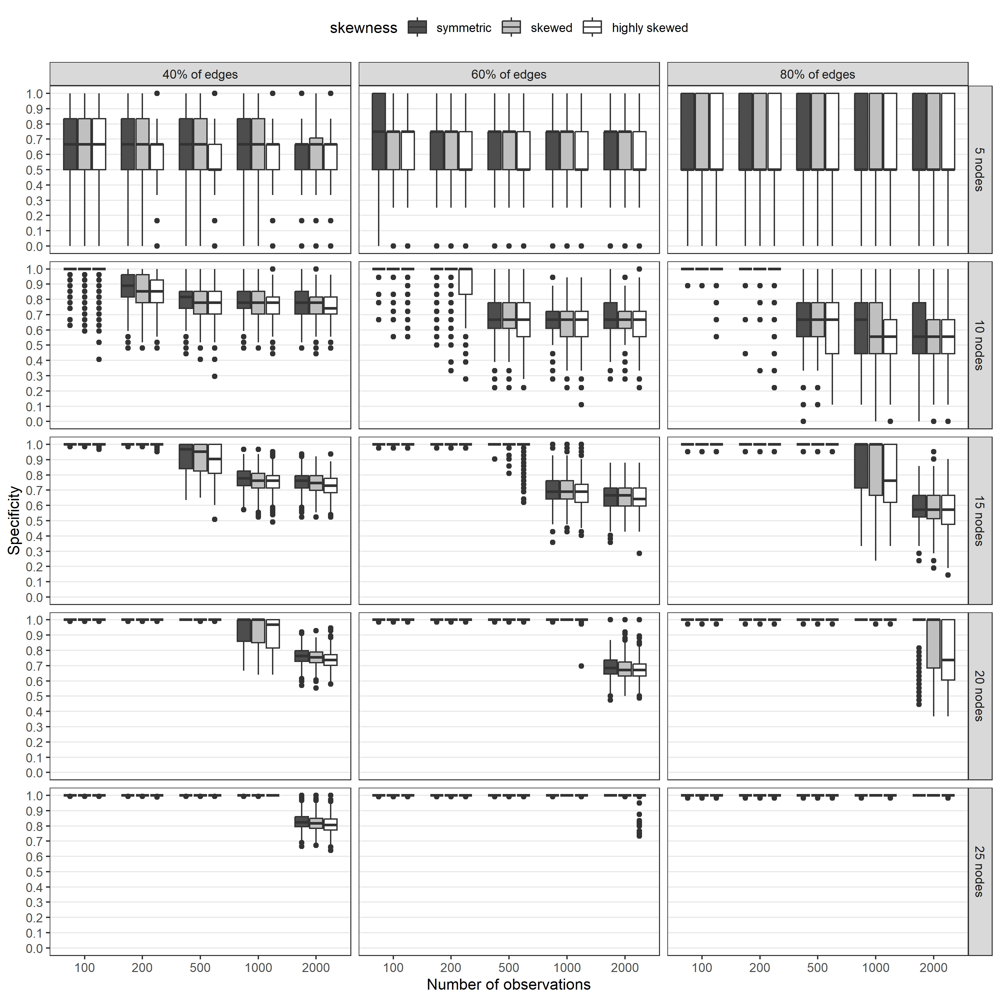
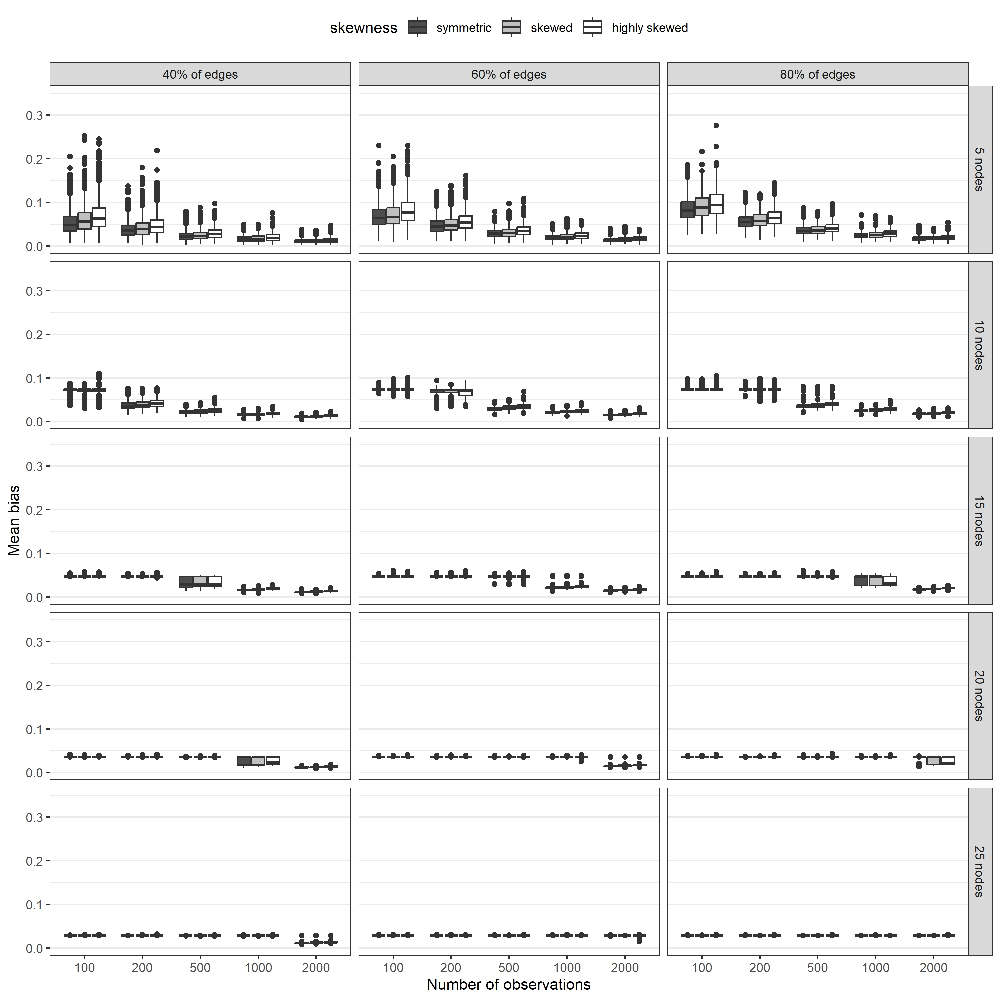

# A Monte Carlo simulation study of the Gaussian graphical model

## Background
During the last decade, psychological networks have become a popular way of investigating mental health data ([Contreras et al., 2019](https://karger.com/pps/article-pdf/88/2/71/3482157/000497425.pdf); [Robinaugh et al., 2020](https://www.ncbi.nlm.nih.gov/pmc/articles/PMC7334828/)). In the network framework, a mental disorder is represented by a graph (usually called a network) consisting of nodes and edges. Nodes represent symptoms of a disorder and edges represent direct relationships between the symptoms. According to the network theory of mental disorders, such a graph represents mechanisms responsible for the onset and maintenance of a mental disorder and it may be used to plan therapeutic interventions and/or prevention programs ([Borsboom, 2017](https://onlinelibrary.wiley.com/doi/full/10.1002/wps.20375)). As direct relationships between symptoms are not easily observable, they need to be estimated from the data generated by the mechanisms. However, the accuracy of the estimation may differ depending on the applied statistical model and the properties of the data (e.g., sample size) and the graph (e.g., number of nodes). Therefore, in this project, I aimed to perform a Monte Carlo simulation study to investigate the accuracy of the most popular model, [the Gaussian graphical model (GGM)](https://www.tandfonline.com/doi/pdf/10.1080/00273171.2018.1454823) regularized using graphical lasso based on the extended Bayes information criterion.

## Simulation conditions
The conditions of the simulation study were based on the networks which are most frequently encountered in the literature and included:
* properties of a model
   * number of nodes in a network (`5`, `10`, `15`, `20`, or `25` nodes),
   * ratio of present edges (`40%`, `60%`, or `80%` of edges present),
* and properties of data
   * skewness of categorical data (`symmetric`, `skewed`, or `highly skewed`),
   * and number of observations in a sample (`100`, `200`, `500`, `1000`, `2000`).

All edges in the networks were positive.

*Figure 1. Different distributions of data used in the study.*

## Populational models
The 15 populational models used in the study (being the result of crossing the conditions for the number of nodes and the ratio of present edges) are presented below. Each condition is described by (a) mean edge weight, (b) standard deviation of edge weights, and (c) maximum edge weight.

*Figure 2. Populational models used in the study.*

## Most important results
### Percentage of empty networks
The results showed that only data based on the models with 5 nodes can be used to estimate non-empty networks in samples comprising 200 observations or more. Other models required higher sample sizes and these increased steeply as the number of nodes and the ratio of edges present increased (see Figure 3). Surprisingly, the distribution of the data had a negligible effect on the estimation of non-empty networks.

*Figure 3. Percentage of empty networks estimated in each condition.*

### Metrics of accuracy

Most of the metrics used in the study showed identical patterns. The estimated networks more accurately resembled the populational model when:
* sample size is larger,
* the number of non-zero edges is lower,
* the ratio of edges present is lower.

The only exception was `specificity` which converged to around `.70` when the sample size increased.

The following figures present:
* sensitivity,
* specificity,
* correlation coefficient,
* mean bias,
* standard deviation of bias,
* maximum bias,
* difference between mean edge weight,
* difference between maximum edge weight,
* maximum false edge weight.

Please note that you need to take into account the percentage of empty networks when interpreting these results as these metrics are meaningless when almost all networks are empty.  

*Figure 4. Sensitivities for networks estimated in each condition.*

*Figure 5. Specificities for networks estimated in each condition.*

*Figure 6. Correlation coefficients between edge weights estimated in each condition and edge weights in the populational model.*

*Figure 7. Mean biases for networks estimated in each condition.*

*Figure 8. Standard deviations of biases for networks estimated in each condition.*

*Figure 9. Maximum biases for networks estimated in each condition.*

*Figure 10. Difference between mean edge weights estimated in each condition and mean edge weights in the populational model.*

*Figure 11. Difference between maximum edge weights estimated in each condition and maximum edge weights in the populational model.*

*Figure 12. Maximum false edge weights for networks estimated in each condition.*

